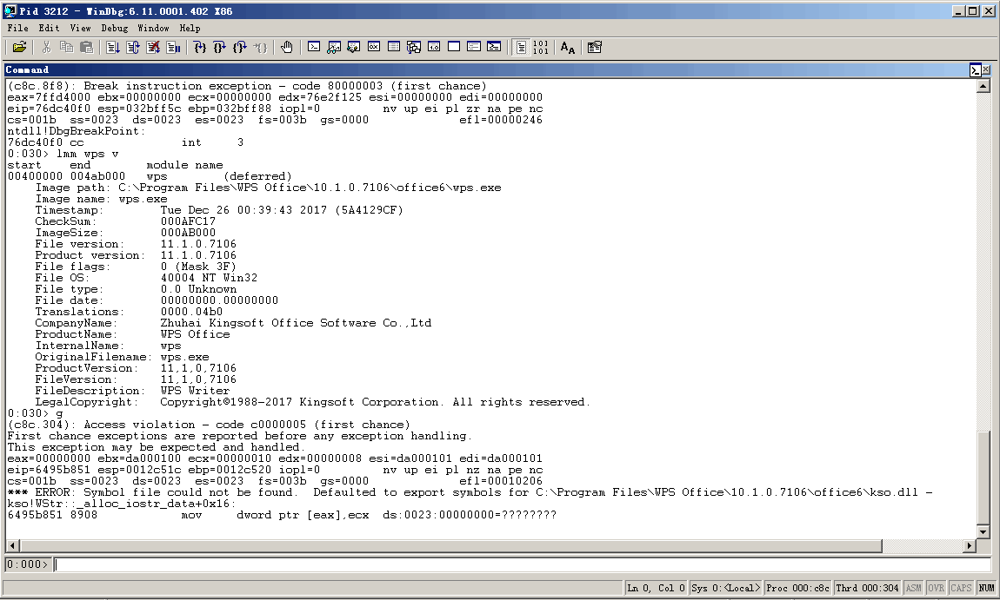
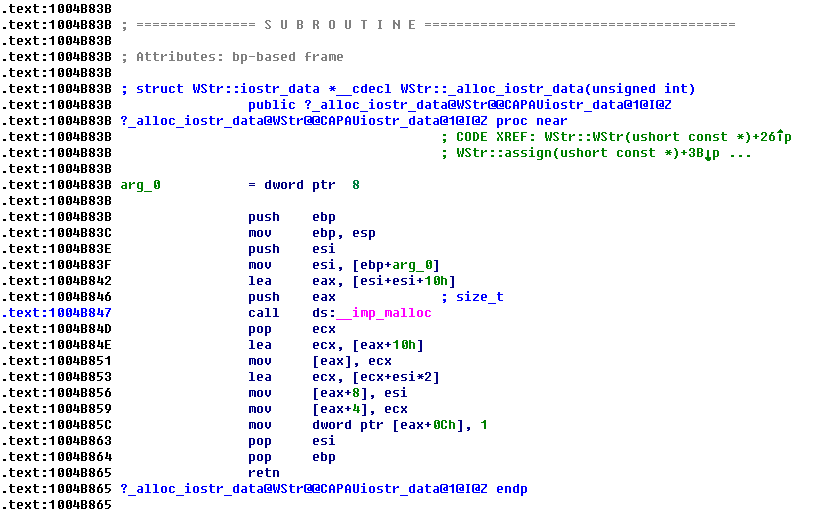

# An issue was discovered in WPS Office

Here is an issue in WPS Office 10.2.0.5978 and 10.1.0.7106, and possibly have impacted other versions.

Remote attackers could leverage this vulnerability to cause a denial of service via a crafted (a) web page, (b) office document, or (c) .rtf file.

It was discovered in the module of kso.dll.

At the crash point, calculating its offset from the starting address of kso.dll.

Using IDA to examine the codes. When it called the malloc function, without any check, the memory address of the return value was been written. Causing access violation.

