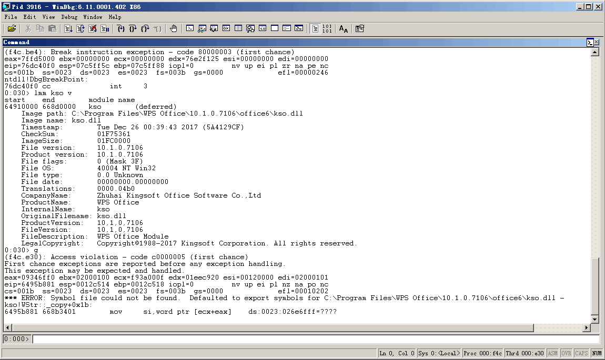
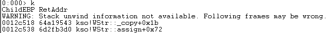
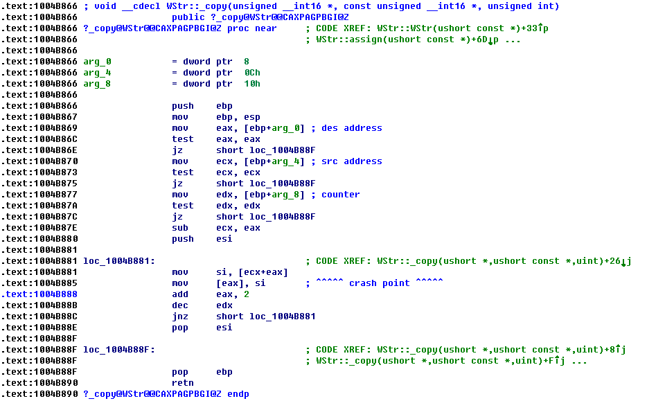
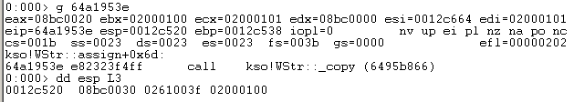
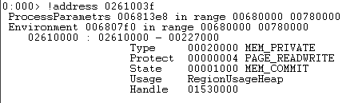
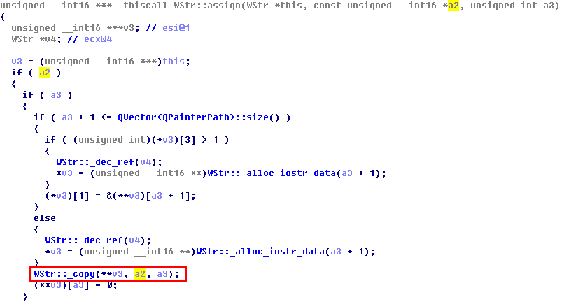

# An issue was discovered in WPS Office

Here is an issue in WPS Office 10.2.0.5978 and 10.1.0.7106, and possibly have impacted other versions.

Remote attackers could leverage this vulnerability to cause a denial of service (application crash) via a crafted (a) web page, (b) office document, or (c) .rtf file.

It was discovered in the module of kso.dll.

Looking at the stack of calls.

At the crash point, calculating its offset from the starting address of kso.dll.

In kso!WStr::_copy() function, arg_0 is the destination  memory address, arg_4 is the source memory address, and arg_8 stands for the counter.

When it calls kso!WStr::_copy() function, looking at the 3 arguments.

Checking the size of the source block, as follows:

The size of the source memory block is 0x00227000. The counter passing to kso!WStr::_copy() function is 0x02000100, and each copy needs 2 bytes. So the size of existence is much smaller than the requied.

In kso!WStr::_copy() function, when source space is exhausted, triggered access violation.

Finally, in a nutshell, the reason of the issue is that there is no valid check of the size of the source memory block before calling the kso!WStr::_copy() function, and the issue arises from kso!WStr::assign() function.

